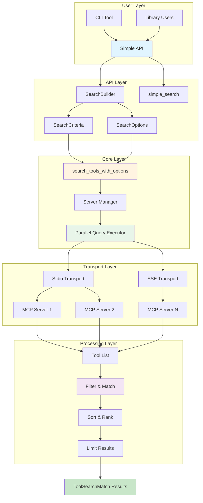

# Architecture

This document describes the architecture of toolsearch-rs, including design decisions, component structure, and data flow.

## Overview

toolsearch-rs is designed to solve the tool discovery problem in agentic AI systems by providing intelligent search and filtering of MCP tools across multiple servers. The architecture prioritizes:

1. **Simplicity**: Easy-to-use API that hides complexity
2. **Performance**: Parallel queries and efficient filtering
3. **Reliability**: Error handling and timeout management
4. **Flexibility**: Multiple search modes and customization options

## System Architecture



## Component Structure

### 1. API Layer (`src/search.rs`)

**Purpose**: Provides simple, intuitive interface for users

**Components**:
- `SearchBuilder`: Builder pattern for constructing searches
- `simple_search()`: One-function search for common cases
- `load_servers()`: Configuration loading with validation

**Design Decisions**:
- Auto-detection of search modes (regex, keywords, substring)
- Sensible defaults for all options
- Progressive enhancement (simple → advanced)

### 2. Core Library (`src/lib.rs`)

**Purpose**: Core search functionality and data structures

**Key Components**:

#### SearchCriteria
- Encapsulates search parameters
- Supports multiple search modes
- Field-specific search configuration
- Case sensitivity control

#### SearchOptions
- Timeout configuration
- Sort order preferences
- Error handling behavior
- Result limiting

#### ServerConfig
- Server connection configuration
- Transport type selection
- Validation logic

#### ToolSearchMatch
- Result structure
- Contains tool and server information
- Helper methods for data access

**Design Decisions**:
- Separation of concerns (criteria vs options)
- Immutable data structures where possible
- Builder pattern for complex configurations

### 3. Transport Layer (`src/lib.rs`)

**Purpose**: Handle MCP protocol communication

**Components**:
- `connect_to_server()`: Establish connection to MCP server
- `list_tools_from_server_with_timeout()`: Query tools with timeout
- Transport implementations (stdio, SSE)

**Design Decisions**:
- Timeout support at connection and query level
- Error recovery (continue on failure)
- Parallel execution for multiple servers

### 4. Search Engine (`src/lib.rs`)

**Purpose**: Execute searches and filter results

**Components**:
- `search_tools_with_options()`: Main search orchestration
- `SearchCriteria::matches()`: Tool matching logic
- `SearchCriteria::text_matches()`: Text matching algorithms

**Search Modes**:
1. **Substring**: Simple contains matching (default)
2. **Regex**: Regular expression pattern matching
3. **Keywords**: All keywords must be present
4. **Word Boundary**: Whole word matching

**Design Decisions**:
- Compiled regex caching for performance
- Case-insensitive by default
- Search across multiple fields (name, title, description, schema)

### 5. CLI Interface (`src/main.rs`)

**Purpose**: Command-line tool for tool discovery

**Commands**:
- `search`: Search for tools matching query
- `list`: List all tools from all servers
- `validate`: Validate configuration file

**Design Decisions**:
- Minimal required options
- Auto-detection of search modes
- Multiple output formats (text, JSON, table)
- Clear, actionable error messages

## Data Flow

### Search Flow

```
1. User provides query
   ↓
2. SearchBuilder constructs SearchCriteria
   ↓
3. Auto-detect search mode (regex/keywords/substring)
   ↓
4. Validate server configurations
   ↓
5. Execute parallel queries to all servers
   ↓
6. Filter tools using SearchCriteria::matches()
   ↓
7. Sort results according to SearchOptions
   ↓
8. Limit results if specified
   ↓
9. Return ToolSearchMatch results
```

### Error Handling Flow

```
1. Server connection fails
   ↓
2. Check SearchOptions::continue_on_error
   ↓
3a. If true: Log error, continue with other servers
3b. If false: Return error immediately
   ↓
4. Collect errors from all failed servers
   ↓
5. Return partial results with error information
```

## Design Patterns

### 1. Builder Pattern
- `SearchBuilder`: Fluent API for constructing searches
- Method chaining for readability
- Progressive enhancement

### 2. Strategy Pattern
- Multiple search modes (Substring, Regex, Keywords, WordBoundary)
- Pluggable matching algorithms
- Runtime selection based on query

### 3. Factory Pattern
- `load_servers()`: Creates ServerConfig instances
- Validates during creation
- Error handling built-in

### 4. Error Handling Pattern
- Custom error types (`ToolSearchError`)
- Error recovery strategies
- Detailed error messages

## Performance Considerations

### Parallel Execution
- All server queries execute in parallel using `futures::join_all`
- Reduces total query time from O(n) to O(1) for n servers
- Critical for systems with many MCP servers

### Timeout Management
- Configurable timeouts prevent hanging
- Applied at both connection and query level
- Default: 30 seconds (configurable)

### Result Limiting
- Early termination when limit reached
- Reduces memory usage
- Improves response time

### Regex Caching
- Compiled regex patterns cached in SearchCriteria
- Avoids recompilation on repeated matches
- Significant performance improvement for regex searches

## Security Considerations

### Input Validation
- Server configuration validation before use
- Prevents invalid commands from being executed
- URL validation for SSE transport

### Process Isolation
- Each MCP server runs in separate process
- Stdio transport provides isolation
- Errors in one server don't affect others

### Error Information
- Error messages don't expose sensitive information
- Server names and errors logged appropriately
- No credential leakage in error messages

## Extension Points

### Adding New Search Modes
1. Add variant to `SearchMode` enum
2. Implement matching logic in `text_matches()`
3. Add builder method to `SearchBuilder`
4. Update auto-detection logic

### Adding New Transports
1. Add variant to `TransportConfig` enum
2. Implement connection logic in `connect_to_server()`
3. Add validation in `ServerConfig::validate()`
4. Update examples and documentation

### Adding New Output Formats
1. Add format string to CLI
2. Implement formatting in `print_results()`
3. Add serialization if needed
4. Update documentation

## Module Structure

```
src/
├── lib.rs          # Core library, data structures, search logic
├── search.rs       # Simplified high-level API
├── error.rs        # Error types and handling
└── main.rs         # CLI interface
```

## Dependencies

### Core Dependencies
- `rmcp` (0.8): MCP protocol implementation
- `tokio`: Async runtime for parallel execution
- `futures`: Parallel query execution utilities
- `regex`: Pattern matching for regex search mode

### CLI Dependencies
- `clap`: Command-line argument parsing
- `serde_json`: JSON serialization/deserialization

### Utility Dependencies
- `anyhow`: Error context and chaining
- `thiserror`: Custom error types
- `tokio-util`: Timeout utilities

## Testing Strategy

### Unit Tests
- Test individual components in isolation
- Test search criteria matching logic
- Test configuration validation

### Integration Tests
- Test end-to-end search flows
- Test error handling scenarios
- Test parallel query execution

### Example Tests
- Examples serve as integration tests
- Verify API usability
- Document usage patterns

## Future Architecture Considerations

### Caching Layer
- Add caching between API and Core layers
- Cache tool lists per server
- Configurable TTL and invalidation

### Plugin System
- Allow custom search modes via plugins
- Allow custom transports via plugins
- Extensibility without modifying core

### Metrics Layer
- Add observability between layers
- Track performance metrics
- Monitor error rates

## Trade-offs

### Simplicity vs Flexibility
- **Choice**: Prioritize simplicity with progressive enhancement
- **Rationale**: Most users need simple cases, advanced users can use builder pattern
- **Impact**: Easy to use, but some advanced features require more code

### Performance vs Memory
- **Choice**: Parallel execution uses more memory but much faster
- **Rationale**: Speed is critical for agentic AI use cases
- **Impact**: Fast queries, but higher memory usage with many servers

### Error Recovery vs Fail-Fast
- **Choice**: Continue on error by default
- **Rationale**: Partial results better than complete failure
- **Impact**: More resilient, but may hide some errors

## References

- [MCP Protocol Specification](https://modelcontextprotocol.io)
- [rmcp Documentation](https://docs.rs/rmcp)
- [Rust Async Patterns](https://rust-lang.github.io/async-book/)

