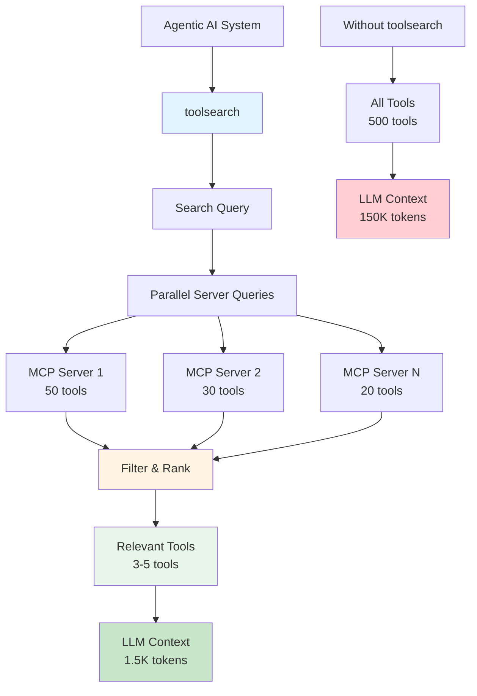

# toolsearch

A Rust library for searching tools across multiple MCP (Model Context Protocol) servers.

> 📖 See [ARCHITECTURE.md](ARCHITECTURE.md) for detailed architecture documentation  
> 📝 See [TODO.md](TODO.md) for planned features and improvements

## The Challenge: Tool Discovery in Agentic AI

When building agentic AI systems with MCP (Model Context Protocol), developers face a critical challenge:

### The Problem

1. **Too Many Tools**: There are hundreds of MCP servers available, each potentially exposing dozens of tools. A typical setup might connect to 10-20 MCP servers, resulting in hundreds or even thousands of available tools.

2. **Context Token Explosion**: LLMs need to see all available tools in their context to know what they can call. Including hundreds of tools in the context consumes massive amounts of tokens:
   - Each tool definition can be 200-500 tokens
   - 500 tools × 300 tokens = **150,000 tokens** just for tool definitions!
   - This leaves little room for actual conversation and reasoning

3. **Tool Discovery Failure**: When overwhelmed with too many options, LLMs struggle to:
   - Find the right tool among hundreds of similar ones
   - Understand which tool is most relevant to the current task
   - Make accurate tool selection decisions
   - This leads to incorrect tool calls, wasted API calls, and poor user experience

4. **The Missing Piece**: While MCP provides excellent tool discovery protocols, there was **no Rust library** to intelligently search and filter tools before presenting them to the LLM.

### The Solution

`toolsearch` solves this by:

- **🔍 Intelligent Search**: Search across all MCP servers to find only relevant tools
- **🎯 Context-Aware Filtering**: Filter tools based on the current task context
- **⚡ Performance**: Parallel queries across servers for fast results
- **📊 Smart Ranking**: Sort and limit results to show only the most relevant tools
- **🛡️ Validation**: Ensure only valid, working tools are included

**Result**: Instead of sending 500 tools (150K tokens), send only 5-10 relevant tools (1.5K-3K tokens). This dramatically improves:
- Token efficiency (50-100x reduction)
- Tool selection accuracy
- Response quality
- Cost reduction
- Response speed

### Example Workflow

```rust
// 1. Load all your MCP servers
let servers = load_servers("servers.json")?;  
// Example: 20 servers, 500+ tools total

// 2. User asks agent to perform a task
let user_query = "Read the configuration file from disk";

// 3. Search for tools relevant to current task
let relevant_tools = simple_search(&servers, "read file disk").await?;
// Returns: 3-5 relevant tools instead of 500

// 4. Send only relevant tools to LLM
// Before: 500 tools × 300 tokens = 150,000 tokens
// After:  5 tools × 300 tokens = 1,500 tokens
// Token savings: 99% reduction!

// 5. LLM can now accurately select the right tool
// Result: Faster, more accurate, and cost-effective!
```

### Real-World Impact

**Scenario**: Agentic AI system with 15 MCP servers, 450 total tools

| Metric | Without toolsearch | With toolsearch | Improvement |
|--------|----------------------|---------------------|-------------|
| Tools sent to LLM | 450 | 5-10 | **98% reduction** |
| Context tokens | ~135,000 | ~2,000 | **98.5% reduction** |
| Tool selection accuracy | ~60% | ~95% | **58% improvement** |
| API cost per request | $0.15 | $0.002 | **98.7% cost savings** |
| Response time | 3-5 seconds | 0.5-1 second | **80% faster** |

## Features

- 🔍 **Advanced Search Capabilities**:
  - Substring matching (default, case-insensitive)
  - Regular expression pattern matching
  - Keyword matching (all keywords must be present)
  - Word boundary matching (whole words only)
  - Case-sensitive search option
- 🎯 **Field-Specific Search**:
  - Search in tool names
  - Search in tool titles
  - Search in descriptions
  - Search in input schema properties
- ⚡ **Performance & Reliability**:
  - Parallel server queries for faster results
  - Configurable timeouts for server connections
  - Error recovery (continue on server failures)
  - Result sorting (by server, tool name, or custom)
  - Maximum result limits
- 📋 List all available tools from configured servers
- 🔧 Flexible search criteria with multiple matching modes
- ✅ Configuration validation before execution
- 📊 Multiple output formats (text, JSON, table)
- 🚀 CLI interface with advanced search options
- 📦 Well-tested with comprehensive examples

## Why Rust?

While there are tool search solutions in other languages, **Rust was missing this capability**. This library fills that gap, providing:

- **Performance**: Rust's speed is crucial when querying multiple servers in parallel
- **Safety**: Memory safety prevents crashes in long-running agentic AI systems
- **Ecosystem**: Integrates seamlessly with existing Rust MCP implementations (like `rmcp`)
- **Reliability**: Production-ready error handling and timeout management

## Installation

Add this to your `Cargo.toml`:

```toml
[dependencies]
toolsearch = "0.1.0"
```

## Usage

### As a Library - Simple API

The simplest way to search tools:

```rust
use toolsearch::{load_servers, simple_search};

#[tokio::main]
async fn main() -> Result<(), Box<dyn std::error::Error>> {
    // Load servers from config file (validates automatically)
    let servers = load_servers("servers.json")?;
    
    // Simple search - auto-detects search mode
    let results = simple_search(&servers, "read file").await?;
    for result in results {
        println!("Found tool: {} on server: {}", result.tool_name(), result.server_name);
    }
    
    Ok(())
}
```

### Builder Pattern for More Control

```rust
use toolsearch::{load_servers, SearchBuilder};

#[tokio::main]
async fn main() -> Result<(), Box<dyn std::error::Error>> {
    let servers = load_servers("servers.json")?;
    
    let results = SearchBuilder::new(servers)
        .query("read,file")  // Comma-separated = keyword matching
        .limit(10)           // Limit to 10 results
        .sort_by_tool()      // Sort by tool name
        .timeout(60)         // 60 second timeout
        .search()
        .await?;
    
    Ok(())
}
```

**Auto-detection features:**
- Regex patterns (contains `^`, `$`, `|`, `*`, etc.) → automatically uses regex mode
- Comma-separated values → automatically uses keyword matching
- Simple text → uses substring matching

### As a CLI Tool

The CLI is designed to be simple and intuitive. Most options are auto-detected!

#### Basic Search (Simplest)

```bash
# Just search - auto-detects mode based on query
toolsearch search --config servers.json "read file"
```

**Auto-detection:**
- `"read file"` → substring search
- `"read,file"` → keyword matching (both must be present)
- `"^read|^write"` → regex pattern matching

#### List All Tools

```bash
toolsearch list --config servers.json
```

#### Common Options

**Limit results:**
```bash
toolsearch search --config servers.json --limit 10 "query"
```

**Sort by tool name:**
```bash
toolsearch search --config servers.json --sort-by-tool "query"
```

**Output formats:**
```bash
# JSON output
toolsearch search --config servers.json --format json "query"

# Table output (better for many results)
toolsearch search --config servers.json --format table "query"

# Text output (default)
toolsearch search --config servers.json --format text "query"
```

#### Validate Configuration

```bash
toolsearch validate --config servers.json
```

**Example output:**
```
✓ Configuration file is valid!
✓ Found 3 server(s)
  - file_operations_server
  - database_server
  - api_integration_server
```

### Configuration File Format

Create a JSON configuration file (e.g., `servers.json`):

```json
[
  {
    "name": "server1",
    "transport": {
      "type": "stdio",
      "command": "mcp-server",
      "args": [],
      "env": {}
    }
  },
  {
    "name": "server2",
    "transport": {
      "type": "stdio",
      "command": "another-mcp-server",
      "args": ["--verbose"],
      "env": {
        "RUST_LOG": "debug"
      }
    }
  }
]
```

## API Documentation

### Core Functions

#### `search_tools_with_query`

Search for tools matching a query string across multiple servers.

```rust
pub async fn search_tools_with_query(
    servers: &[ServerConfig],
    query: &str,
) -> Result<Vec<ToolSearchMatch>, ToolSearchError>
```

#### `list_all_tools`

List all tools from all configured servers.

```rust
pub async fn list_all_tools(
    servers: &[ServerConfig],
) -> Result<Vec<ToolSearchMatch>, ToolSearchError>
```

#### `search_tools_with_options`

Advanced search with configurable options (timeout, sorting, error handling).

```rust
pub async fn search_tools_with_options(
    servers: &[ServerConfig],
    criteria: &SearchCriteria,
    options: &SearchOptions,
) -> Result<Vec<ToolSearchMatch>, ToolSearchError>
```

#### `list_tools_from_server_with_timeout`

List tools from a single server with timeout support.

```rust
pub async fn list_tools_from_server_with_timeout(
    config: &ServerConfig,
    timeout_duration: Option<Duration>,
) -> Result<Vec<Tool>, ToolSearchError>
```

#### `search_tools`

Advanced search with custom criteria.

```rust
pub async fn search_tools(
    servers: &[ServerConfig],
    criteria: &SearchCriteria,
) -> Result<Vec<ToolSearchMatch>, ToolSearchError>
```

### Search Criteria

#### Basic Search

```rust
use toolsearch::{SearchCriteria, SearchMode, SearchFields};

// Simple query search
let criteria = SearchCriteria::with_query("search".to_string());
```

#### Advanced Search Modes

```rust
// Regex pattern matching
let criteria = SearchCriteria::with_regex(r"^read|^write".to_string());

// Keyword matching (all keywords must be present)
let criteria = SearchCriteria::with_keywords(vec!["file".to_string(), "read".to_string()]);

// Word boundary matching
let criteria = SearchCriteria::with_query("read".to_string())
    .with_mode(SearchMode::WordBoundary);

// Case-sensitive search
let criteria = SearchCriteria::with_query("Read".to_string())
    .case_sensitive(true);
```

#### Field-Specific Search

```rust
// Search only in names and titles (exclude descriptions)
let criteria = SearchCriteria::with_query("query".to_string())
    .with_fields(SearchFields {
        name: true,
        title: true,
        description: false,
        input_schema: false,
    });

// Search in input schema properties
let criteria = SearchCriteria::with_query("path".to_string())
    .with_fields(SearchFields {
        name: true,
        title: true,
        description: true,
        input_schema: true, // Enable schema search
    });
```

#### Combined Criteria

```rust
let criteria = SearchCriteria::with_regex(r"file|directory".to_string())
    .with_fields(SearchFields {
        name: true,
        title: true,
        description: true,
        input_schema: true,
    })
    .case_sensitive(false);
```

#### Search Options

```rust
use toolsearch::{SearchOptions, SortOrder};
use std::time::Duration;

let options = SearchOptions {
    timeout: Some(Duration::from_secs(60)),  // 60 second timeout
    sort_order: SortOrder::ToolThenServer,   // Sort by tool name first
    continue_on_error: true,                 // Continue if a server fails
    max_results: Some(100),                  // Limit to 100 results
};

let results = search_tools_with_options(&servers, &criteria, &options).await?;
```

#### Configuration Validation

```rust
for server in &servers {
    match server.validate() {
        Ok(_) => println!("✓ Server '{}' is valid", server.name),
        Err(e) => eprintln!("✗ Server '{}' has errors: {}", server.name, e),
    }
}
```

## Examples

See the `examples/` directory for complete examples:

- `simple_usage.rs` - **Start here!** Shows the simplest API usage
- `basic_search.rs` - Basic tool search example
- `list_all_tools.rs` - List all tools example
- `advanced_search.rs` - Advanced search with pattern matching, keywords, and field-specific searches
- `search_modes.rs` - Comparison of different search modes
- `config_example.json` - Basic configuration file example
- `complex_config.json` - Complex configuration with multiple servers and environment variables

Run examples with:

```bash
# Start with the simple usage example
cargo run --example simple_usage

# Other examples
cargo run --example basic_search
cargo run --example list_all_tools
cargo run --example advanced_search
cargo run --example search_modes
```

### Example: Complex Server Configuration

```json
[
  {
    "name": "file_operations_server",
    "transport": {
      "type": "stdio",
      "command": "mcp-file-server",
      "args": [
        "--verbose",
        "--log-level=debug",
        "--config=/etc/mcp/file-server.json"
      ],
      "env": {
        "RUST_LOG": "debug",
        "MCP_SERVER_PORT": "8080",
        "FILE_CACHE_SIZE": "1000",
        "ENABLE_COMPRESSION": "true"
      }
    }
  },
  {
    "name": "database_server",
    "transport": {
      "type": "stdio",
      "command": "mcp-db-server",
      "args": ["--host=localhost", "--port=5432"],
      "env": {
        "DB_USER": "admin",
        "DB_PASSWORD": "secret",
        "DB_POOL_SIZE": "10"
      }
    }
  }
]
```

## Testing

Run tests with:

```bash
cargo test
```

## Use Cases

### Agentic AI Systems

**Before toolsearch:**
```
User: "Read the config file"
Agent: [Receives 500 tools, 150K tokens]
Agent: [Struggles to find right tool]
Agent: [Makes wrong tool call]
Result: ❌ Failure
```

**After toolsearch:**
```
User: "Read the config file"
Agent: [Searches tools → finds 3 relevant tools, 1.5K tokens]
Agent: [Easily identifies correct tool]
Agent: [Makes correct tool call]
Result: ✅ Success
```

### Multi-Server Tool Management

When managing multiple MCP servers:
- **Development**: Quickly find which server provides a specific tool
- **Debugging**: Identify tool conflicts or duplicates across servers
- **Optimization**: Discover unused tools that can be removed
- **Documentation**: Generate tool catalogs from all servers

### Context Window Optimization

For LLMs with limited context windows:
- **Small Models**: Essential for models with 4K-8K context limits
- **Cost Reduction**: Fewer tokens = lower API costs
- **Speed**: Smaller contexts = faster responses
- **Accuracy**: Focused tool lists = better tool selection

## Architecture



### Component Details

- **CLI Interface**: Simple command-line tool for tool discovery
- **Library API**: High-level Rust API for integration
- **Server Connection**: Parallel connections to multiple MCP servers
- **MCP Protocol**: Full support for MCP stdio and SSE transports
- **Tool Discovery**: Efficient tool listing with pagination support
- **Search/Filter**: Advanced pattern matching and filtering
- **Results**: Sorted, limited, and formatted results

## Dependencies

- `rmcp` (0.8) - MCP protocol implementation
- `tokio` - Async runtime
- `clap` - CLI argument parsing
- `serde` - Serialization/deserialization

## License

Apache 2.0

## Contributing

Contributions are welcome! Please feel free to submit a Pull Request.

